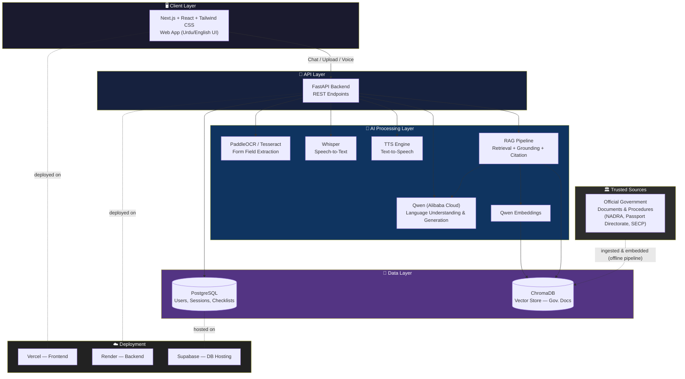
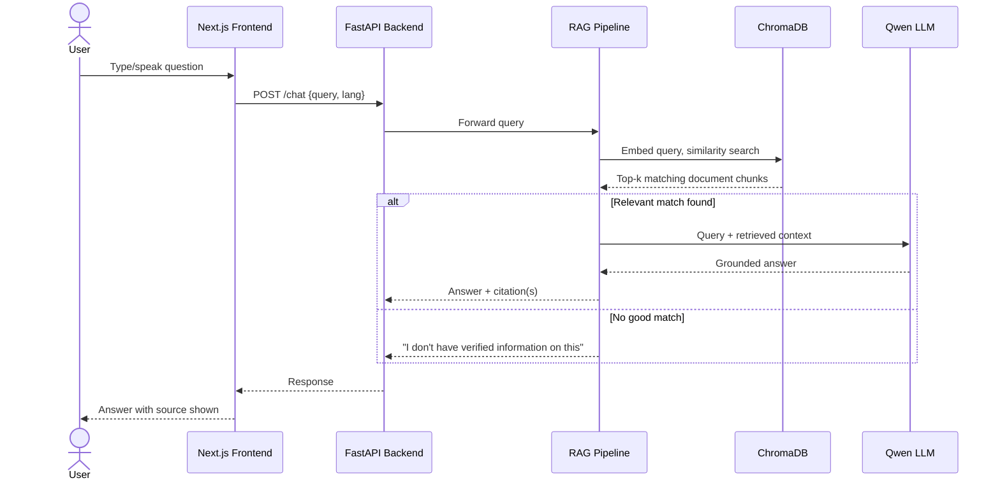
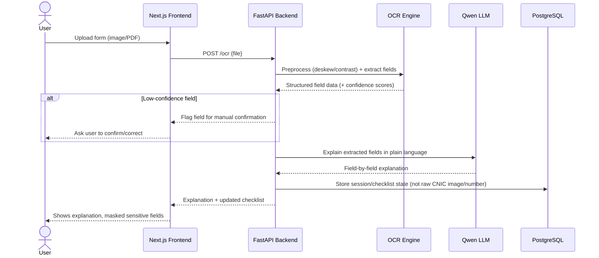
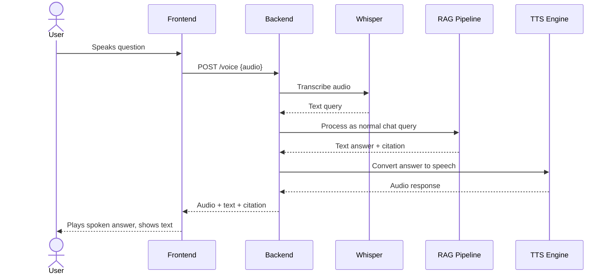

# RaahAI — Architecture

This document describes the technical architecture of RaahAI in detail: system components, data flow, and how each piece connects.

---

## 1. High-Level System Architecture

---

## 2. Component Breakdown

### 2.1 Client Layer (Frontend)
- **Framework:** Next.js + React
- **Styling:** Tailwind CSS
- **Responsibilities:**
  - Chat interface (Urdu/English toggle)
  - File upload UI (forms/documents)
  - Voice input/output controls
  - Checklist display
  - Rendering citations under AI answers

### 2.2 API Layer (Backend)
- **Framework:** FastAPI
- **Responsibilities:**
  - Route requests to the right AI service (chat, OCR, voice)
  - Manage sessions and user state
  - Enforce validation (file size/type, input sanitization)
  - Orchestrate the RAG pipeline

### 2.3 AI Processing Layer

| Component | Purpose |
|---|---|
| **RAG Pipeline** | Core logic: takes a query, retrieves matching official-source chunks from ChromaDB, sends them + the query to Qwen, returns a grounded answer with citations |
| **Qwen (LLM)** | Generates natural-language answers and field explanations |
| **Qwen Embeddings** | Converts text (government docs + user queries) into vectors for similarity search |
| **OCR Engine** | Extracts text/fields from uploaded form images (PaddleOCR primary, Tesseract fallback) |
| **Whisper (STT)** | Converts spoken user input into text |
| **TTS Engine** | Converts AI text responses into spoken audio |

### 2.4 Data Layer
- **PostgreSQL:** Structured data — user sessions, checklist state, uploaded-form metadata (not raw sensitive data)
- **ChromaDB:** Vector store holding embedded chunks of official government documents, used for retrieval

### 2.5 External Sources
- Official government websites/documents (NADRA, Passport Directorate, SECP) — ingested offline into ChromaDB, not fetched live during a user request

### 2.6 Deployment
- **Vercel:** Hosts the Next.js frontend
- **Render:** Hosts the FastAPI backend
- **Supabase:** Hosts PostgreSQL

---

## 3. Data Flow — Chat with RAG

---

## 4. Data Flow — Document Upload & OCR

---

## 5. Voice Flow

---

## 6. Security & Privacy Notes

- CNIC and other sensitive identifiers are **not persisted** beyond the session
- Sensitive fields are **masked** in the UI (e.g. `XXXXX-1234567-X`)
- Government source ingestion happens **offline**, not via live scraping during user requests, reducing risk of serving unverified/live content
- RAG pipeline includes a **grounding guardrail**: if no relevant match is found in ChromaDB, the system explicitly declines rather than falling back to the LLM's ungrounded parametric knowledge

---

## 7. Scalability Notes (Post-MVP)

- ChromaDB can be swapped for a managed vector DB (e.g. Pinecone/Weaviate) as document volume grows
- OCR pipeline can be queued (e.g. via a task queue) if form upload volume increases
- Additional services (Driving License, Tax Filing) can be added as new document collections in ChromaDB + new checklist logic, without changing the core architecture
